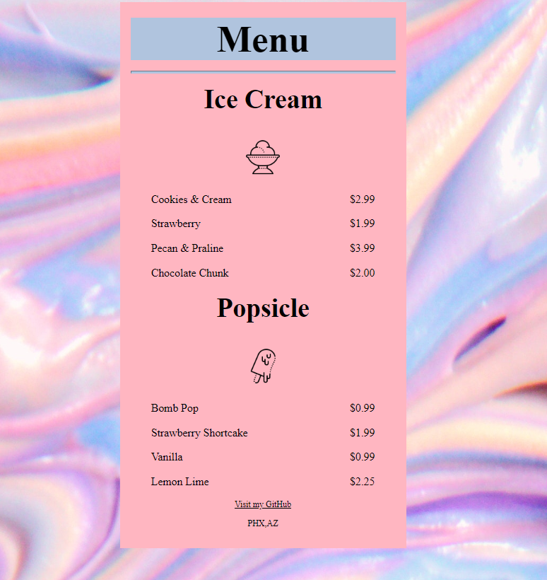

# Ice Cream Menu
### My rendition of the "freeCodeCamp.org/MenuCafe" CSS Assignment
## About Project 
this project was to focus on functionality of HTML & CSS together by 
building a simple 'Cafe Menu' with a background, some images and elements with style that show case
a menu that holds a product description, prices for the products on the menu and a few images 
that show what the items on sale are. 

## freeCodeCamp Cafe Menu 

## My rendition of the 'Cafe Menu' ( Ice Cream Menu)

